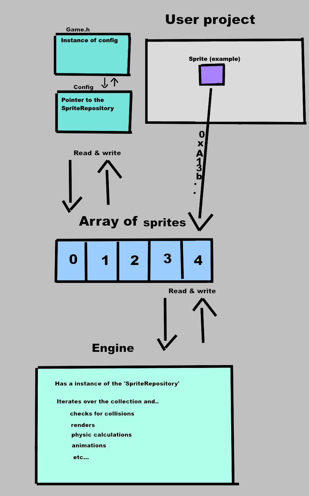

# Welcome To Sprite Engine

This Project is a simple **2D Game Engine** designed to be fully understand by one Person.

## Tools used
- **SFML**
- **Dear ImGui** 
- **Rene** 

## Features

- **UI editor**
- **Scene creation**
- **Box collision detection**
- **Parent-Child collision Stopping** 
- **Physics**
- **Animations (supported by editor)**
- **Scripting with C++** 
- **Project creator**
- **Automatic project builder**

----    
## Enhancements
- **Sound manager**
- **More C++ functions**
- **Cleaner design**
- **Box collider rotation**
---

## Getting Started

The engine calls the only 1 update and 1 Start Method of the "Game" class, if you create a new Script you need to
call the update method from the script in the "Game" class. If you want to share instances simply pass them in the 
update methods or set a pointer to it in the start method. You can get acces to a sprite by calling 
`this->config.ptr_sprites->getSpriteWithName("name");` This method returns a pointer to the sprite in the `SpriteRepository`
. Now you are able to do all kind of things with the sprite. Please note that the engine does still have alot of bugs!

You can get started by downloading the Engine folder [here](https://github.com/jkatsanis/SpriteEngineUI)

You can find a Introduction to the engine on [YouTube](https://www.youtube.com/watch?v=pnCD5dKhpmg)

1. **Create a Project**

    In the folder open the .exe and create a new project by clicking on the create button. 

    A File Dialog will open, select where u want to create the project and hit the '**+**' button.

    All the files from the **template** folder will be automatically copied to the location the user selected his project to be.

    The folder will have the name the user selected, the **.sln** file and the **.exe** wont have the same name as the **project name**. 

    By the way, if you hit `build` or `STRG + B` in the engine the .exe will automaticly build into a folder. So you don't need to worry about messing around with ressources/dll's

2. **How Do I Script My Sprites?**

   In the Game Engine you can right click in the Asset folder and select **New -> C++ Script**, this will create a new Script containing the **update** and **start** functions.
   (You can find the docs the the functions in the engine)

   You can create a new **Sprite ptr** in your class:

    ```C++
    class Game : public s2d::Base
    {
    private:
        Sprite* m_sprite;
    }

    ```
   You can give the **Sprite ptr** a address by calling the **s2d::Sprite::getSpriteByName("name");** function, to search for a sprite with the name **'name'**. This will return a **'nullptr'** or the adress to this sprite.

    ```C++
    void Game::start()
    {
        this->m_sprite = this->configptr_sprites->getSpriteWithName("name");`
    }
    ```

    Finally you can change the properties of the sprite using the **update** function for example: 


    ```C++
    void Game::update()
    {
        if(Input::onKeyHold(KeyBoardCode::A))
        {
            this->m_sprite.transform.position.x -= 700 * Time::deltaTime;
        }
    }
    ```
3. **How do the sprites get managed?** 

    All the sprites are getting managed by a object called `SpriteRepository`. This object contains a private list of sprites, you can add sprites to the scene by using this `repository`. For example

    ```C++
    void Game::start()
    {
        Sprite* spr = new Sprite();
        this->config.ptr_sprites.add(spr);
    }
    ```
    This will autamticly add the sprite to the repository and it will take care of the rendering / calculating collisons, physics etc. Of course you need to active the necceasary components like 
    ```C++
    void Game::start()
    {
        Sprite* spr = new Sprite();
        spr.collider.exist = true;
    }
    ```
    to have a basic collision detection.

    Here is a simple imagine showing how the `Sprite Repository` works:

    
   

